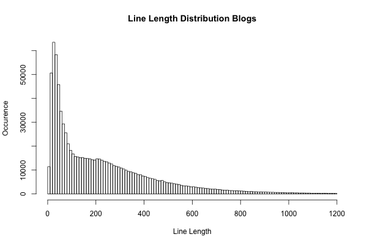
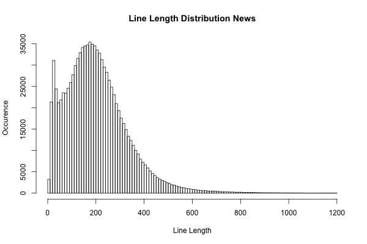
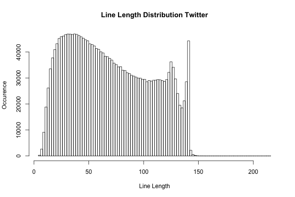
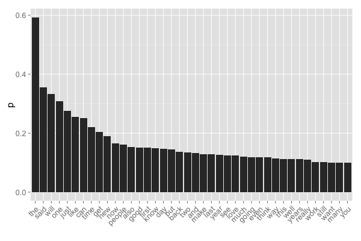
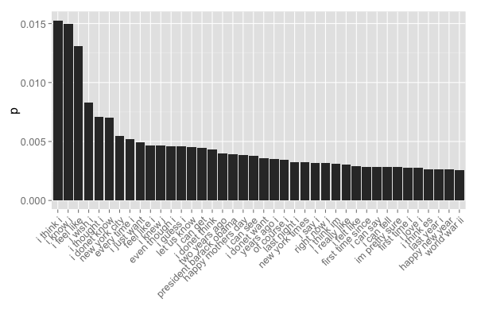

# DS Specialization Capstone Project: Milestone Report

Martin Hediger, PhD 

## Introduction
The task is to develop an application that provides suggestions
for words based on words typed by the user.

The application is trained on data from blogs, news and twitter texts.

The application basically works by calculating probabilities of uni-, di-
and tri-grams.
Then, input is cross-checked against these calculated probabilities.

In the following, a number of summary results are shown followed by data cleaning and tokenization results. Ideally the presented results are understandable by
non-data science specialists. Therefore details descriptions of the methods are at the end
of the report.

## Results
### Basic summary analysis
Distribution of line lengths in the three data sets (blogs, news and Twitter):





It is apparent that the line length distribution of twitter posts falls off
sharply at 140 characters (the limit of a twitter post).

The data has the following summary statistics.

```
Data set  Total number of words     Number of lines     Line length mean
------------------------------------------------------------------------
Blogs:                 37334131              899288                  234
News:                  34372530             1010242                  204
Twitter:               30373583             2360148                   71
------------------------------------------------------------------------
```

### Basic tokenization analysis
The most frequently occuring 1-grams, 2-grams and 3-grams over all sets are illustrated.

The term-document matrices for uni-, di- and trigrams are converted to `data.table` type and
additional columns for relative occurence `p` (sum of occurence of an N-gram per total number of N-grams) and `log(p)` are calculated.

Order by occurence `p` gives the following results (tables given in appendix).





Interestingly, a number of stopwords are still in the term-document matrix, such as `i`,
`the`, `this` or `your`. Probably these words are not considered stopwords, depending on the
lexcial context within which the tokenizer finds them.

## Conclusions and Outlook
The above analysis already allows to draw some conclusion.

1) It seems as if occurence `p` of the n-grams falls off rapidly. It is assumed at this stage, that there is a cutoff `p'`, below which n-grams do not contribute further to the model accuracy. It is planned to study which cutoff provides the best trade-off between accuracy and speed (e.g. by an ROC analysis). From the users point of view, it is better to have some suggestion which might be not very accurate, than have a very slow application that requires long time to compute the next suggestion.

2) Basic inspection shows that already with a limited training set, reasonable distributions of probabilities and n-grams are obtained. Perhaps the size of the training set, and therefore the size of the term-document matrices can further be optimized.

3) The application mechanism currently under development is that whenever a user types an input, say "i know", the programm will use `grep` to identify this string within the tri-gram term document matrix.
From the identified tri-grams containing "i know", it will return the one with the highest probability `p` and suggest the third token of the respective tri-gram as the next word.
In this example, based on the above figures, it would be the word "i".


**Note: The following content is considered technical detail**


## Methods
### Initial data preprocessing
In the following, we prepare the training setup.
Basic preprocessing consists of removal of stopwords, punctuation and numbers
and stripping of whitespace.
All characters are converted to lower case
The input data is encoded as ASCII, allowing for efficient removal of
additional UTF-8 encoding signals.

### Tokenization
Tokenization is done using the tokenizer application from the `RWeka`
package.
An important note is that the `RWeka` package requires to set
`options(mc.cores=1)` due to discrepancies when working with multiple
cores.
Uni-, di- and tri-gram tokenizers are prepared individually`:
```{r eval=FALSE}
library(RWeka)
NGT <- function(N, x)
{
    NGramTokenizer(x, Weka_control(min=N, max=N))
}
```

Term-document matrices of the corpus `crp` are prepared for uni-, di- and trigrams and sparse terms sparsity of >0.5 are removed.
```{r eval=FALSE}
library(tm)
tdm <- TermDocumentMatrix(crp, control=list(tokenize=NGT))
tdm <- removeSparseTerms(tdm, 0.5)
```

Currently, all development is carried out on a very limited data set in
order to avoid extensive computational cost.
However, it is strongly assumed that the outlined methods translate easily
to the complete data set.


### Line length distribution measurement
Extracting line lengths for the individual entries in the blogs, news and Twitter data sets using Python.
```
f = open("./en_US.twitter.txt", "r")
d = f.readlines()`
f.close()
line_length_distribution = []
for i in range(len(d)):
    line_length_distribution.append(len(d[i]))
f = open("line_length_distribution_twitter.dat", "w")
for i in line_length_distribution:
    f.write(str(i) + "\n")
f.close()
```

Histograms and mean line length are then calculated in R.
```
f <- readLines("./line_length_distribution_twitter.dat")
f <- as.numeric(f)
p <- png("./line_length_distribution_twitter.png", width=600, height=400)
hist(f[f<1200], main="Line Length Distribution Twitter", xlab="Line Length",
     ylab="Occurence", breaks=100)
dev.off()
mean(f)
```

### Counting number of words
Done in Python (illustrated for blogs).
```
f = open("en_US.blogs.txt", "r")
d = f.readlines()
n_words_blogs = []
for i in d:
    n_words_blogs.append(len(i.split()))
sum(n_words_blogs)
```

### Preparation of n-gram probability ranking plot
```
k <- tmd[order(tdm$p, decreasing=T)][1:40]

library(ggplot2)

theme_set(theme_gray(base_size=16))

ggplot(k, aes(x=reorder(rn, -p), y=p))
+ geom_bar(stat="identity")
+ xlab("") 
+ theme(axis.text.x=element_text(angle=45, hjust=1))
```


## Appendix

Unigrams:
```
> tdmunidt[order(tdmunidt$p, decreasing=T)]
             rn blogs  news twit    sm            p       logp
    1:      the 10248 12239 2001 24488 5.924851e-01 -0.5234296
    2:     said  1955 12352  400 14707 3.558346e-01 -1.0332893
    3:     will  6246  5484 2008 13738 3.323897e-01 -1.1014471
    4:      one  6814  4102 1786 12702 3.073238e-01 -1.1798534
    5:     just  5595  2660 3123 11378 2.752897e-01 -1.2899312
   ---                                                        
41327:   zither     1     1    0     2 4.838983e-05 -9.9362209
41328:     ziti     0     1    1     2 4.838983e-05 -9.9362209
41329: zoellick     1     1    0     2 4.838983e-05 -9.9362209
41330:   zurich     1     1    0     2 4.838983e-05 -9.9362209
41331:     zuzu     0     1    1     2 4.838983e-05 -9.9362209
```

Digrams:
```
> tdmdidt[order(tdmdidt$p, decreasing=T)]
                   rn blogs news twit   sm            p       logp
     1:       i think  1235  617  491 2343 1.818845e-02  -4.006968
     2:        i know  1004  273  463 1740 1.350743e-02  -4.304515
     3:        i love   755   91  647 1493 1.159000e-02  -4.457613
     4:         i can   919  194  367 1480 1.148908e-02  -4.466358
     5:        i just   672  214  481 1367 1.061187e-02  -4.545782
    ---                                                           
128814:       zoo san     0    1    1    2 1.552578e-05 -11.073009
128815:        zoom i     1    0    1    2 1.552578e-05 -11.073009
128816:     zoom lens     1    1    0    2 1.552578e-05 -11.073009
128817:  zucchini red     1    1    0    2 1.552578e-05 -11.073009
128818: zumba classes     1    1    0    2 1.552578e-05 -11.073009
```

Trigrams:
```
> tdmtridt[order(tdmtridt$p, decreasing=T)]
                      rn blogs news twit  sm            p      logp
    1:         i think i   164   30   81 275 0.0152625153 -4.182355
    2:          i know i   174   33   63 270 0.0149850150 -4.200705
    3:       i feel like    99   44   93 236 0.0130980131 -4.335295
    4:          i wish i    68    9   73 150 0.0083250083 -4.788491
    5:       i thought i    91   19   18 128 0.0071040071 -4.947096
   ---                                                             
18014:    your time will     1    1    0   2 0.0001110001 -9.105979
18015:   youre never old     0    1    1   2 0.0001110001 -9.105979
18016:   yr old daughter     1    0    1   2 0.0001110001 -9.105979
18017: ysidro port entry     0    1    1   2 0.0001110001 -9.105979
18018:     zoo san diego     0    1    1   2 0.0001110001 -9.105979
```
